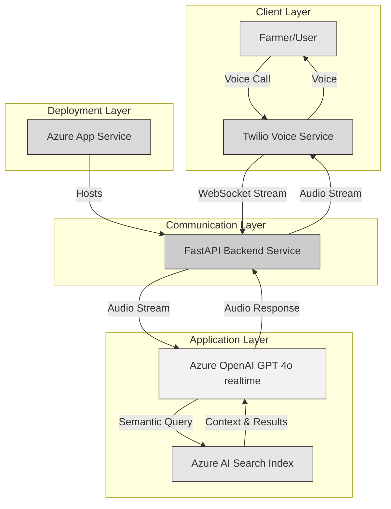
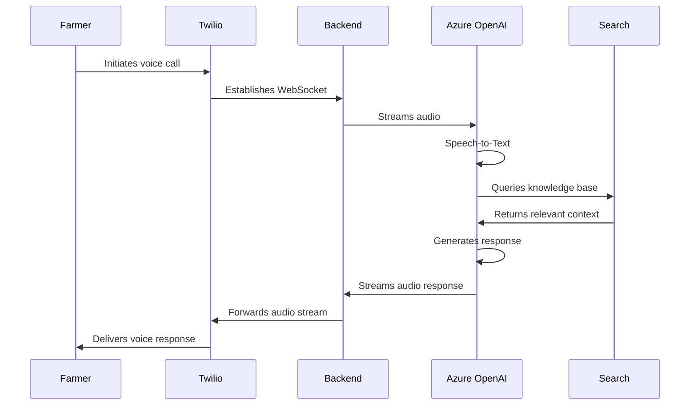

# Kisan Mitra - AI-Powered Agricultural Assistant

Kisan Mitra is an intelligent voice-based agricultural assistant designed to empower Indian farmers with real-time agricultural knowledge and support in their native languages. The system combines traditional farming wisdom with modern agricultural practices to provide personalized, actionable advice.

## Project Overview

Kisan Mitra addresses the critical need for accessible agricultural expertise by providing a voice-based interface that farmers can use to get immediate answers to their farming-related questions. The system supports multiple Indian languages, making it accessible to farmers across different regions of India.

## Current Implementation Scope

This is a pilot implementation designed to demonstrate the potential of AI-powered agricultural assistance. Key implementation notes:

1. **Static Knowledge Base**:
   - Uses pre-configured datasets for agricultural information
   - Knowledge base includes curated content about farming practices, crop management, and agricultural guidelines
   - Data is not automatically updated from external sources

2. **Focused Functionality**:
   - Demonstrates core voice interaction capabilities
   - Shows multilingual support potential
   - Implements basic agricultural query-response system
   - Uses static datasets for proof of concept

3. **Limited Integration**:
   - No direct integration with external data providers
   - Weather, market prices, and government scheme information is based on static data
   - Focus is on demonstrating the interaction model and multilingual capabilities

## Future Scope and Enhancements

The system has significant potential for expansion. Planned future enhancements include:

1. **Real-time Data Integration**:
   - Integration with government agricultural portals for latest schemes and policies
   - Real-time weather data integration for location-specific advice
   - Live market price feeds from agricultural markets (mandis)
   - Integration with soil testing labs for personalized soil management

2. **Advanced AI Capabilities**:
   - Implementation of Model Context Protocol for enhanced data and action integration
   - Computer vision integration for crop disease identification through images
   - Predictive analytics for crop yield estimation
   - Personalized crop calendars based on local conditions

3. **Enhanced Interaction**:
   - WhatsApp integration for text and image-based interactions
   - Support for additional Indian languages and dialects
   - Voice-based authentication for personalized advice
   - Integration with IoT devices for real-time farm monitoring

4. **Knowledge Enhancement**:
   - Dynamic knowledge base updates from agricultural research institutions
   - Integration with local agricultural universities for region-specific advice
   - Crowd-sourced farming wisdom with expert validation
   - Machine learning-based content curation and validation

5. **Ecosystem Integration**:
   - Connection with local farmer producer organizations (FPOs)
   - Integration with e-commerce platforms for agricultural inputs
   - Links to agricultural credit and insurance providers
   - Connection with agricultural equipment rental services

6. **Monitoring and Analytics**:
   - Usage pattern analysis for service improvement
   - Impact assessment metrics
   - Farmer feedback integration
   - Regional agricultural trend analysis

### Key Features

- **Multilingual Support**: Communicates in multiple Indian languages including Hindi, Marathi, Punjabi, and English
- **Voice-First Interface**: Natural conversation through voice calls, making it accessible to all farmers
- **Contextual Understanding**: Provides relevant advice based on specific farming contexts and conditions
- **Knowledge Integration**: Combines traditional farming practices with modern agricultural techniques
- **Real-time Assistance**: Immediate response to farming queries and emergencies

## Value Proposition

1. **Accessibility**: Breaks down language and literacy barriers through voice-based interaction
2. **Comprehensive Knowledge**: Integrates information from multiple agricultural domains:
   - Crop management and planning
   - Pest and disease control
   - Weather-related guidance
   - Market prices and trends
   - Government schemes and policies
3. **Cost-Effective**: Provides expert agricultural advice without the need for in-person consultations
4. **24/7 Availability**: Round-the-clock access to farming knowledge
5. **Sustainable Practices**: Promotes environmentally conscious and sustainable farming methods

## Technical Architecture

### System Components

The following diagram illustrates the high-level architecture of Kisan Mitra. The Azure AI Search Index represents a comprehensive, dynamic index of agricultural data (crop management, soil health, weather, market trends, government schemes, and more). The Azure OpenAI Service block integrates both speech processing (STT/TTS) and language model capabilities.



### Functional Flow



## Technology Stack

- **Backend Framework**: FastAPI
- **Voice Interface**: Twilio Voice API
- **Azure Open AI Services**:
  - Azure Open AI GPT 4o realtime for natural language understanding and generation
  - Azure Open AI text embedding model for knowledge base indexing
- **Azure AI Search Services**:
  - Azure AI Search for storing and querying agricultural knowledge base
  - Azure AI Search for semantic search and filtering
- **Development Tools**:
  - Python 3.11
  - WebSocket protocol for real-time communication
  - Azure App Service for deployment
  - Azure OpenAI SDK
  - Azure AI Search SDK

## Knowledge Base Coverage

The system provides expertise in various agricultural domains:

1. **Crop Management**
   - Seasonal crop selection
   - Crop rotation practices
   - Soil health management
   - Water management

2. **Risk Management**
   - Weather-related guidance
   - Pest and disease control
   - Emergency response protocols
   - Market price fluctuations

3. **Sustainable Practices**
   - Organic farming methods
   - Water conservation
   - Soil preservation
   - Traditional farming wisdom

4. **Economic Aspects**
   - Market trends and prices
   - Government schemes
   - Storage and processing options
   - Farm diversification

## Deployment Guide

### Prerequisites
- Azure subscription with required services enabled:
  - Azure App Service (Python 3.11)
  - Azure OpenAI GPT-4 with Vision
  - Azure AI Search
  - Azure Key Vault (for secrets)
- Twilio account with Voice API access
- Python 3.11 installed locally
- Azure CLI installed and configured

### Setup Steps

1. **Azure Resources Setup**
   ```bash
   # Login to Azure
   az login
   
   # Create resource group
   az group create --name <resource-group-name> --location <location>
   
   # Create App Service Plan
   az appservice plan create --name <plan-name> --resource-group <resource-group-name> --sku B1 --is-linux
   
   # Create Web App
   az webapp create --name <app-name> --resource-group <resource-group-name> --plan <plan-name> --runtime "PYTHON|3.11"
   ```

2. **Environment Configuration**
   - Create `.env` file with required credentials
   - Set App Service configuration:
   ```bash
   az webapp config appsettings set --resource-group <resource-group-name> --name <app-name> --settings \
     AZURE_OPENAI_API_KEY="<key>" \
     AZURE_OPENAI_API_ENDPOINT="<endpoint>" \
     AZURE_SEARCH_ENDPOINT="<endpoint>" \
     AZURE_SEARCH_KEY="<key>" \
     AZURE_SEARCH_INDEX="<index>" \
     SCM_DO_BUILD_DURING_DEPLOYMENT=true
   ```

3. **Local Testing**
   ```bash
   # Install dependencies
   pip install -r requirements.txt
   
   # Run locally
   python app.py
   ```

4. **Deployment Steps**:
   ```bash
   # Create deployment package
   zip -r app.zip requirements.txt app.py

   # Deploy to Azure App Service
   az webapp deploy --resource-group <resource-group-name> --name <app-service-name> --src-path "<path-to-deployment-package>/app.zip"
   ```

   Replace the placeholders:
   - `<resource-group-name>`: Your Azure resource group name
   - `<app-service-name>`: Your Azure App Service name
   - `<path-to-deployment-package>`: Local path to your deployment package

5. **Post-Deployment**
   - Configure Twilio webhook URL to point to your deployed app's endpoint: `https://<app-name>.azurewebsites.net/incoming-call`
   - Test the deployment using Twilio's test call feature
   - Monitor logs: `az webapp log tail --name <app-name> --resource-group <resource-group-name>`

## Contributing

We welcome contributions to Kisan Mitra! Please feel free to submit issues, fork the repository, and create pull requests for any improvements.

## License

This project is licensed under the MIT License - see the LICENSE file for details.

## Support

For support and queries, please create an issue in the repository or contact the maintainers.

---

*Kisan Mitra - Empowering farmers with AI-powered agricultural wisdom*

